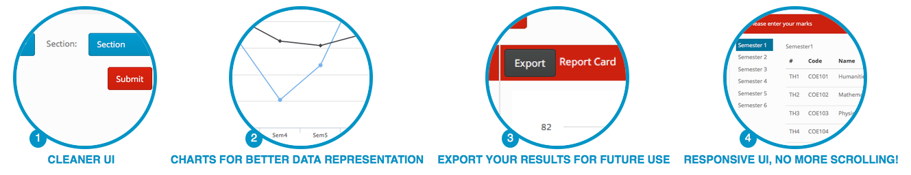

# Pretty Log
A simple React Component to have pretty change log descriptor images.

# Usage 

```jsx
ReactDOM.render(<PrettyLog items = {[
    { title: "Cleaner UI", image: "1.png" },
    { title: "Charts for better data representation", image: "2.png" },
    { title: "Responsive UI, no more scrolling!", image: "3.png" }
]} size = '200px' />, document.getElementById('root'));
```

# Screenshot


# Status

* [ ] Find a way to keep it as customizable as possible
* [x] Create a basic version with only one style
